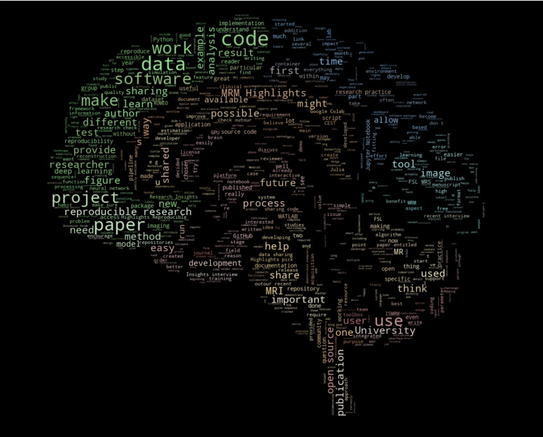

# Abstract

Magnetic resonance imaging has progressed significantly with the introduction of advanced computational methods and novel imaging techniques, but their wider adoption hinges on their reproducibility. This concise review synthesizes reproducible research insights from recent MRI articles to examine the current state of reproducibility in neuroimaging, highlighting key trends and challenges. It also provides a custom GPT model, designed specifically for aiding in an automated analysis and synthesis of information pertaining to the reproducibility insights associated with the articles at the core of this review.

# Introduction

Reproducibility is a cornerstone of scientific inquiry, particularly relevant for data-intensive and computationally demanding fields of research, such as magnetic resonance imaging (MRI) [@Stikov2019-hp]. Ensuring reproducibility thus poses a unique set of challenges and necessitates the diligent application of methods that foster transparency, verification, and interoperability of research findings. 

While numerous articles have addressed the reproducibility of clinical MRI studies, few have looked at the reproducibility of the MRI methodology underpinning these studies. This is understandable given that the MRI development community is smaller, driven by engineers and physicists, with modest representation from clinicians and statisticians. 

However, performing a thorough meta-analysis or a systematic review of these studies in the context of reproducibility presents challenges due to: 

* i) the diversity in study designs across various MRI development subfields, and 
* ii) the absence of standardized statistics to gauge reproducibility performance. 

Considering these challenges, we opted to conduct a mini-review leveraging the semantic extraction capabilities of the advanced language models. Specifically, we trained a custom **GPT** model using a knowledge base constructed for a selection of articles coupled with web scraping of content pertaining to their reproducibility.

With this mini-review we aim to examine the current landscape of reproducible research practices across various MRI studies, drawing attention to common strategies, tools, and repositories used to achieve reproducible outcomes. We anticipate that this approach provides a living review that can be automatically updated to accommodate the continuously expanding breadth of methodologies, helping us identify commonalities and discrepancies across studies.

# Methodology 

In distilling reproducibility insights powered by GPT, this review centered on 31 research articles published in the journal Magnetic Resonance in Medicine (MRM), chosen by the editor for their dedication to enhancing reproducibility in MRI. Since 2020, the journal has published interviews with authors of these selected publications, discussing the tools and practices they used to bolster the reproducibility of their findings (available [here](https://blog.ismrm.org/category/highlights)).

## Mapping selected articles in the semantic landscape of reproducibility

We performed a literature search to identify where these studies fall in the broader literature of reproducible neuroimaging. To retrieve articles dedicated to reproducibility in MRI, we utilized the Semantics Scholar API [Fricke2018-ol] with the following query terms on November 23, 2023: 

* `(code | data | open-source | github | jupyter ) & ((MRI & brain) | (MRI neuroimaging)) & reproducib~`.

Among `1098` articles included in the Semantic Scholar records, SPECTER vector embeddings [@Cohan2020-tw] were available for `612` articles, representing the semantics of publicly accessible content in abstracts and titles. For these articles, the high-dimensional semantic information captured by the word embeddings was visualized using UMAP {cite:p}`McInnes2018-sc` \autoref{fig1stat}. This visualization allowed the inspection of the semantic clustering of the articles, facilitating a deeper understanding of their contextual placement within the reproducibility landscape. In addition, the following diagram illustrates the hierarchical clustering of the selected studies in the broader literature:

```{mermaid}
:align: center
flowchart LR
  subgraph Data collection
  A[/Query terms/] --> B
  E[Web scrape] -- 31 --> F>MRM Highlight interviews]
  end
  B[[Semantic Scholar API]] -- 1098 --> C>Total records]
  C>Total records] --612--> D>Records w/ embedding]
  D --31--> H>MRM Articles]
  F -- match --> D
  D --> G(((UMAP)))
```

## Creating a knowledge base for a custom GPT

We created a custom GPT model, designed specifically to assist in the analysis and synthesis of information pertaining to the `31` reproducible research insights. The knowledge base of this retrieval-augmented generation framework incorporates GPT-4 summaries of the abstracts from `31` MRM articles, merged with their respective MRM Highlights interviews, as well as the titles and keywords associated with each article (refer to Appendix A). This compilation was assembled via API calls to OpenAI on November 23, 2023, using the `gpt-4-1106-preview` model.

```{mermaid}
:align: center
flowchart LR
  A>MRM Highlights Interviews] --> C
  B>Respective MRM Articles]--> C
  C(combine) --> D(((GPT-4)))
  D --> G[(Summary)]
  G --> H
  D --> H["Custom GPT"]
  subgraph RRInsights
  H <--> I[User]
  end
```

This specialized GPT, named `RRInsights`, is tailored to process and interpret the provided data in the context of reproducibility, for the system prompts please see Appendix B. 


# Results

## Contextual placement of the selected articles in the landscape of reproducibility

The MRI systems cluster was predominantly composed of articles published in MRM, with only two publications appearing in a different journal [@Adebimpe2022-zp;@Tilea2009-zu]. Additionally, this cluster was sufficiently distinct from the rest of the reproducibility literature, as can be seen by the location of the dark red dots \autoref{fig1stat}. Few other selected articles (`8/31`) were found at the intersection of the MRI systems, deep learning, and data/workflows clusters, which in total spans `103` articles. Since the custom GPT model was trained on the `31` selected MRM articles (red dots), \autoref{fig1stat} serves as a map for inferring the topics where RRInsights is more likely to be context-aware.


## Custom GPT for reproducibility insights

Through its advanced natural language processing capabilities, RRInsights can efficiently analyze the scoped literature, extract key insights, and generate comprehensive overviews of the research papers focusing on MRI technology. The custom GPT is available at https://chat.openai.com/g/g-5uDwBlnx4-rrinsights (requires subscription as of May 2024).


### GPT-powered summary of the reproducible magnetic resonance neuroimaging	

Most MRI development is done on commercial systems using proprietary hardware and software. Peeking inside the black boxes that generate the images is non-trivial, but it is essential for promoting reproducibility in MRI.

Quantitative MRI articles are powerful showcases of reproducible research practices, as they usually come with fitting models that can be shared on public code repositories. The applications range from MR spectroscopy [@Wilson2021-xg;@Clarke2021-mb;@Songeon2023-ye] to ASL [@Woods2022-ud], diffusion MRI [@Cai2021-hx;@Tristan-Vega2022-vh], CEST [@Huang2022-gk], magnetization transfer [@Rowley2021-yy;@Malik2020-qk;@Asslander2022-dk;@boudreau2024longitudinal], B1 mapping [@Delgado2020-cj] and relaxometry [@Kapre2020-lz;@Lee2019-xr;@Whitaker2020-ir;@Balbastre2022-cy;@boudreau2024repeat;@keenan2025t1@hafyane2018let].

Transparent reconstruction and analysis pipelines [@maier2021cg] are also prominently featured in the reproducible research insights, including methods for real-time MRI [@Zhao2021-ju], parallel imaging [@Hess2021-fl], large-scale volumetric dynamic imaging [@Ong2020-xo], pharmacokinetic modeling of DCE-MRI [@ahmed2020pharmacokinetic], phase unwrapping [@Dymerska2021-tw], hyperpolarized MRI [@Tustison2021-gh], Dixon imaging [@Ryden2020-wf] and X-nuclei imaging [@McCallister2021-gj]. Deep learning is increasingly present in the reproducibility conversation, as MRI researchers are trying to shine a light on AI-driven workflows for phase-focused applications [@Cole2021-xo], CEST [@Huang2022-gk], diffusion-weighted imaging [@Barbieri2020-ue], myelin water imaging [@Lee2020-xf], B1 estimation [@Abbasi-Rad2021-tt], and tissue segmentation [@Estrada2020-xf].

Reproducibility of MRI hardware is still in its infancy, but a recent study integrated RF coils with commercial field cameras for ultrahigh-field MRI, exemplifying the coupling of hardware advancements with software solutions. The authors shared the design CAD files, performance data, and image reconstruction code, ensuring that hardware innovations can be reproduced and utilized by other researchers [@Gilbert2022-io].

Finally, vendor-neutral pulse sequences are putting interoperability and transparency at the center of the reproducibility landscape. Pulseq and gammaSTAR are vendor-neutral platforms enabling the creation of MRI pulse sequences that are compatible with three major MRI vendors [@Layton2017-nz;@Cordes2020-ys]. In addition, VENUS is an end-to-end vendor-neutral workflow that was shown to reduce inter-vendor variability in quantitative MRI measurements of myelin, thereby strengthening the reproducibility of quantitative MRI research and facilitating multicenter clinical trials [@Karakuzu2020-ng;@Karakuzu2022-cb].

#### Data sharing

There is a growing number of studies providing access to raw imaging data, pre-processing pipelines, and post-analysis results. Repositories like Zenodo, XNAT, and the Open Science Framework (OSF) serve as vital resources for housing and curating MRI data. Data sharing is also made easier thanks to unified data representations, such as the ISMRM raw data format [@Inati2017-ql] for standardizing k-space data, and the Brain Imaging Data Structure (BIDS) for organizing complex datasets [@Gorgolewski2016-yn] and their derivatives [@Karakuzu2022-iw]. 

#### Code sharing

Software repositories such as GitHub and GitLab are making it easier to centralize processing routines and to adopt version control, unit tests and other robust software development practices. The introduction of tools for automated QA processes, as seen in the development of platforms like PreQual for DWI analysis [@Cai2021-hx], signifies an emphasis on interoperability and standardization.

The increasing adoption of containerization and virtual environments makes workflows transparent and easy to execute. Tools like Docker and Singularity are used to package computing environments, making them portable and reproducible across different systems. Studies employing these tools enable MRI researchers to replicate computational processing pipelines without dealing with dependency issues in local computational environments [@Karakuzu2022-cb;@Cordes2020-ys;@Estrada2020-xf].

The rise of machine learning and artificial intelligence in MRI necessitates rigorous evaluation to ensure reproducibility. Studies that use deep learning are beginning to supplement their methodological descriptions with the open-source code, trained models, and simulation tools that underpin their algorithms. Algorithms such as DeepCEST, developed for B1 inhomogeneity correction at 7T, showcase how clinical research can be improved by reproducible research practices [@Huang2022-gk]. Sharing these algorithms allows others to perform direct comparisons and apply them to new datasets.

#### Vendor-neutrality

Finally, pulse-sequence and hardware descriptions are slowly entering the public domain [@Layton2017-nz;@Cordes2020-ys;@Karakuzu2020-ng;@Gilbert2022-io]. For a long time MRI vendors have been reluctant to open up their systems [@Stikov2023-jf], but standardized phantoms [@Stupic2021-xy] are creating benchmarks that require transparency and reproducibility. This is particularly relevant for quantitative MRI applications, where scanner upgrades and variabilities across sites are a major hurdle to wider clinical adoption [@Keenan2019-nw;@boudreau2024longitudinal;@Lee2019-xr].

#### Dissemination

Reproducibility is also bolstered by interactive documentation and tools such as Jupyter Notebooks, allowing for dynamic presentation and hands-on engagement with data and methods. Platforms incorporating such interactive elements are being utilized with greater frequency, providing real-time demonstration of analysis techniques and enabling peer-led validation. Resources such as [MRHub](https://ismrm.github.io/mrhub), [MRPub](https://ismrm.github.io/mrpub), [Open Source Imaging]  (https://www.opensourceimaging.org/projects/) and [NeuroLibre](https://neurolibre.org) [Karakuzu2022-sq] serve as a gateway to a wide range of tools and tutorials that promote reproducibility in MRI. The curation of these resources is essential for ensuring that publications featuring Jupyter Notebooks and R Markdown files [@trisovic2022large] remain executable and properly archived [@dupre2022beyond].

# Discussion and Future Directions

The progress towards reproducibility in MRI research points to a distinct cultural shift in the scientific community. The move towards open-access publishing, code-sharing platforms, and data repositories reflects a concerted effort to uphold the reproducibility of complex imaging studies. Adopting containerization technologies, pushing for standardization, and consistently focusing on quality assurance are key drivers that will continue to improve reproducibility standards in MRI research. 




\autoref{fig3} is a word cloud generated from the articles included in this review, highlighting the concepts and vocabulary that is driving reproducibility in MRI. As can be seen from the figure, the components of reproducibility in MRI research are multifaceted, integrating not just data and code, but also the analytical pipelines and hardware configurations. The shift towards comprehensive sharing is motivated both by a scientific ethic of transparency and the practical need for rigorous validation of complex methodologies [@Boudreau2021-yy;@Boudreau2022-hv].

However, this shift is not without challenges [@Niso2022-et]. Variations in data acquisition and analysis methodologies limit cross-study comparisons. Sensitivity to software and hardware versions can impede direct reproducibility. Privacy concerns and data protection regulations can be barriers to data sharing, particularly with clinical images.

While challenges persist, steps are taken by individual researchers and institutions to prioritize reproducibility. Moving forward, the MRI community should work collectively to overcome barriers, institutionalize reproducible practices, and constructively address data sharing concerns to further the discipline's progress. Beyond their benefit in establishing a research culture that is more aligned with the computational demands of modern neuroimaging, end-to-end reproducible workflows offer a powerful technical solution needed to bring metrological rigor to MRI measurements [@cashmore2021clinical]. One drawback of this approach is increased external dependencies [@warrington2023resource], which can be mitigated by the use of data-driven, portable and modular computational pipelines [@karakuzu2019wfl;@di2017nextflow]. Executor agnostic nature of these pipelines also allows for the use of different computational backends, such as cloud computing and high-performance computing resources. This capability is particularly relevant for decoupling the technical complexity of post-acquisition processing from the clinical workflow to create workflows that are more amenable to clinical adoption [@dupuis2024real]. 

Time and again, the literature shows that aligning the acquisitions (i.e., making the protocols similar to the utmost extent possible) do not suffice to achieve multicenter agreement, neither for radiomic (and other morphological) features [@klontzas2024radiomics] nor for quantitative applications [@bauer2010whole]. Absent MRI measurements performed within [a metrological framework using well-defined standards](https://fas.org/publication/ai-enabled-precision-medicine), solutions such as physics-driven corrections [@chhetri2021bloch] or statistical harmonization approaches [@warrington2023resource] can still benefit research studies that are based on existing datasets. Nevertheless, surface-level addressing of discrepancies stemming from the complex interplay between MRI physics and biological systems will be insufficient for developing robust calibration strategies, which remain the only clinically acceptable method to characterize and mitigate hardware-based variability. As quantitative computed-tomography [@skornitzke2022asynchronous] and ultrasound [@hoferer2023new] are coming to the forefront of developing calibration strategies for non-invasive tissue characterization, MRI should also claim its place in the metrological framework. A prerequisite for this is to recognize that a useful measurement aims to establish error bounds in the pursuit of normative values for physiologically relevant parameters [@cashmore2021clinical], rather than modeling the normative values while unaddressed sources of variability persist.

The initiatives and tools identified in this review serve as a blueprint for future studies to replicate successful practices, safeguard against bias, and accelerate neuroscientific discovery. As MRI research continues to advance, upholding the principles of reproducibility will be essential to maintaining the integrity and translational potential of its findings.
We also hope that our methodology in generating this review will pave the way for future studies that leverage large language models to create unique literature insights. In particular, we believe that the RRInsights GPT can serve as a blueprint for generating a scoping review [@mak2022steps] and inspire other scientists to experiment with the format of scientific publications in the age of AI.